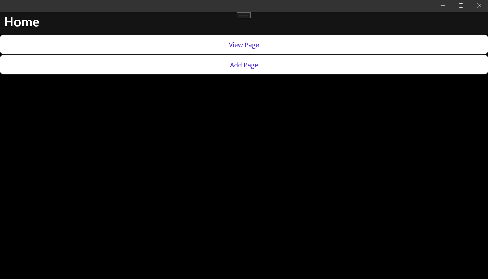
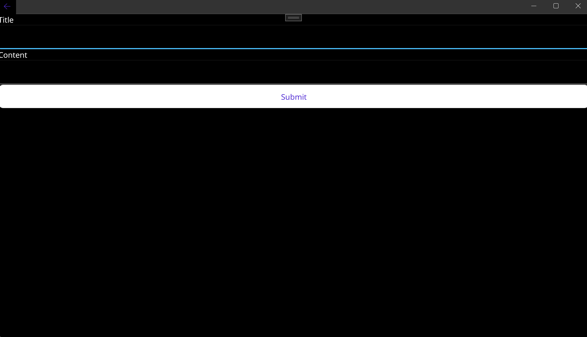
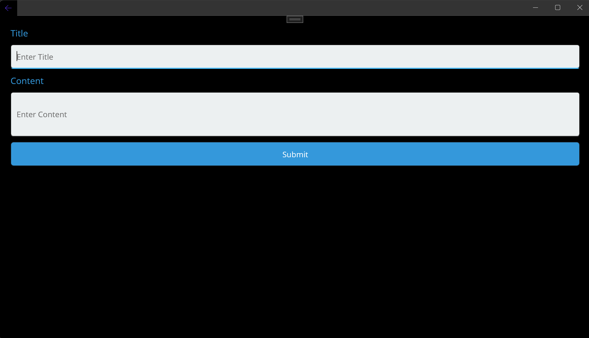
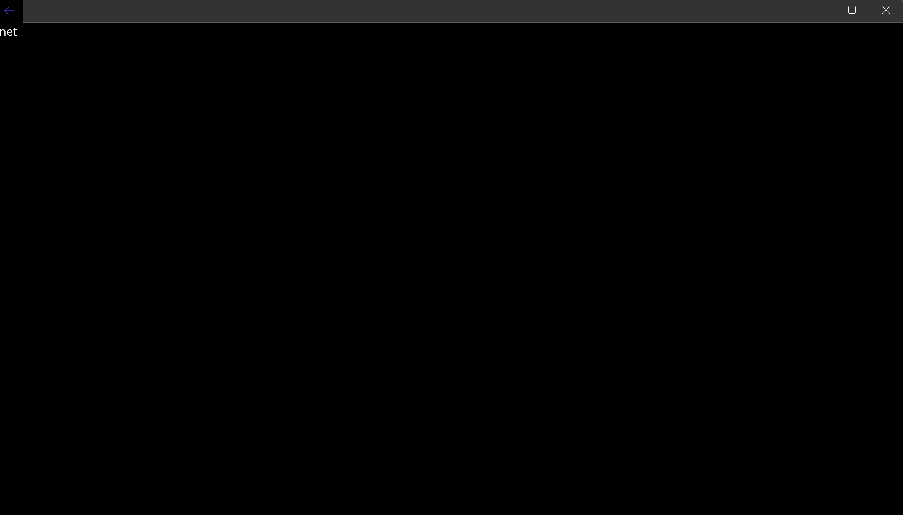
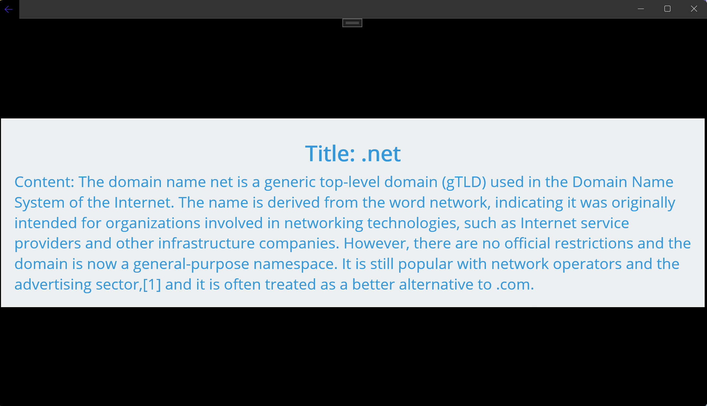

# Welcome to cs797r-project-5

Thank you for visiting our repository!

## About ReadingApplication

This project outlines the development of a reading application, employing the Model-View-ViewModel (MVVM) architecture and database integration. The application allows users to add titles and text to a database, with corresponding buttons for data input. Upon pressing the appropriate button, the application displays the stored data.

# Team
# Github UserName =  sasithekings
# Github UserName =  anusrisamineni

#

# This is the Main page with which we started.

# After adding buttons to the main page

# Main Page after styling 

# Initial Add Page

# Add Page after styling

# Initial View Page

# View Page After Styling

# Content Viewing Page

